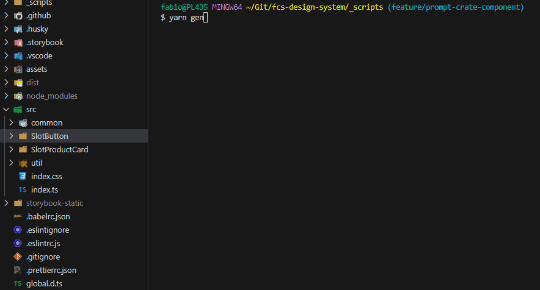

# PROMPT: Component Generator
## prompt-component-gen

To install the [package](https://www.npmjs.com/package/prompt-component-gen):

```console
npm i prompt-component-gen
```
```console
yarn add prompt-component-gen
```

## To run the prompt:
```console
node ./node_modules/prompt-component-gen/dist/main.js
```
Add to your `package.json`
```json
"gen": "node ./node_modules/prompt-component-gen/dist/main.js"
```

### Use the prompt to generate new components 🤖

